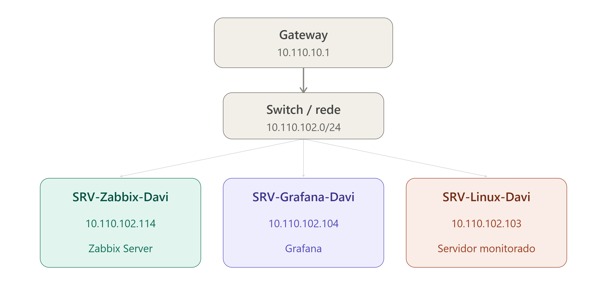
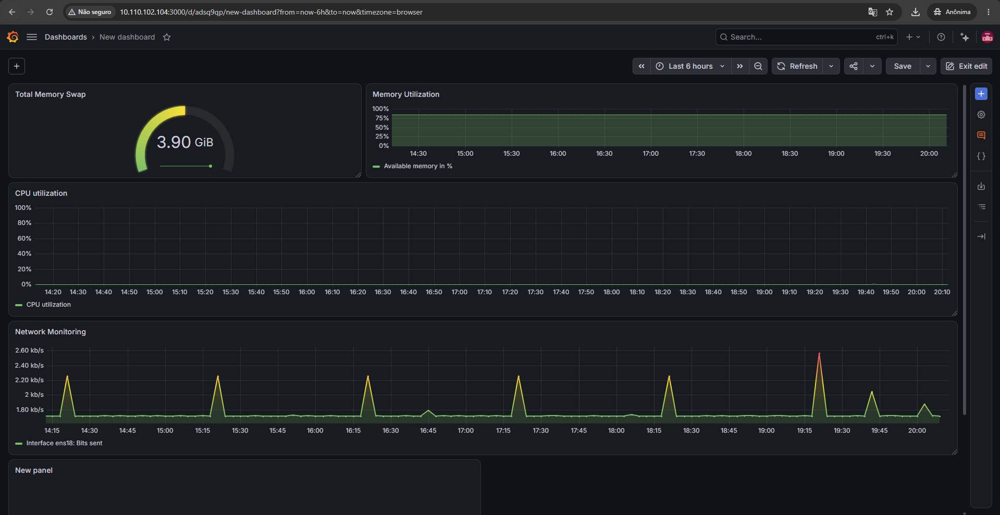
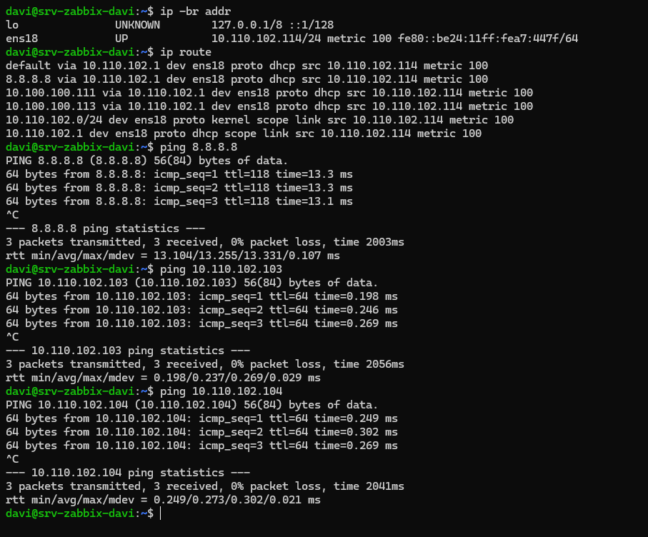
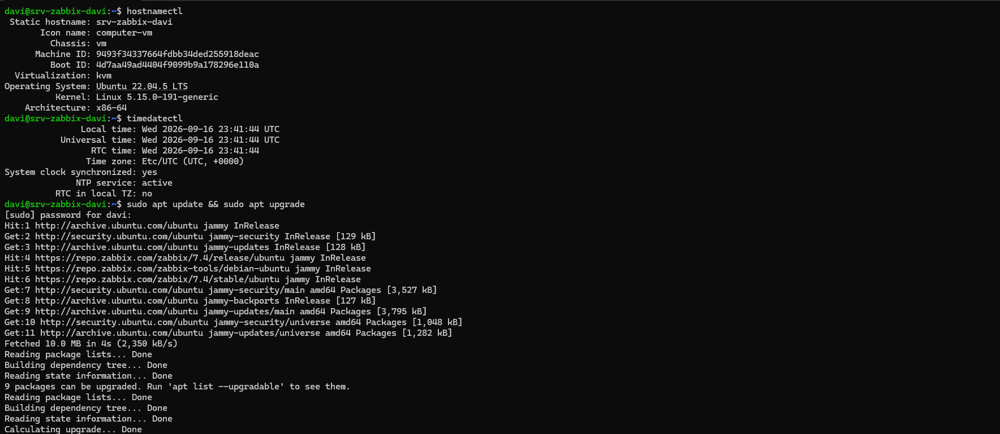
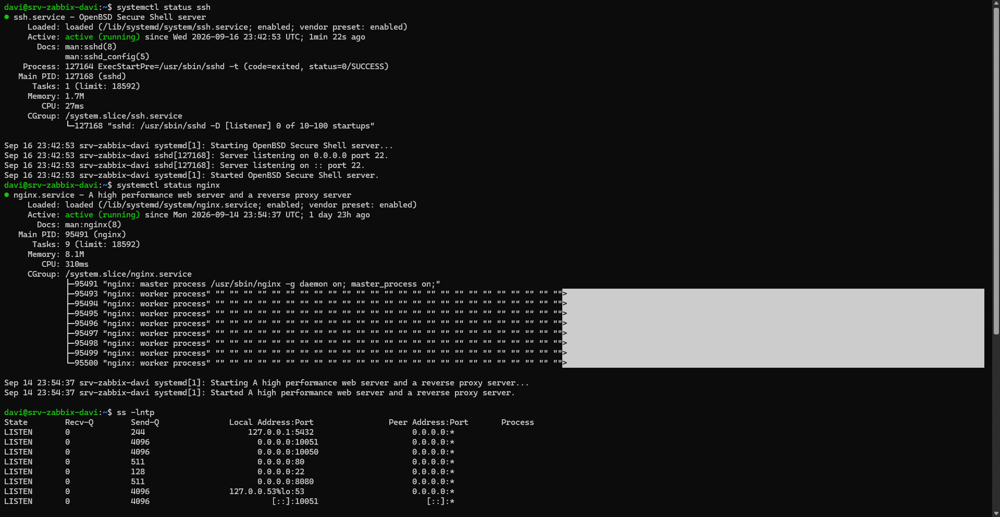
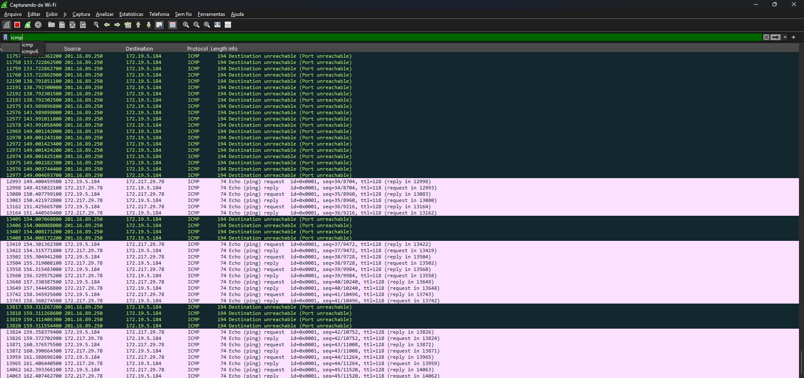
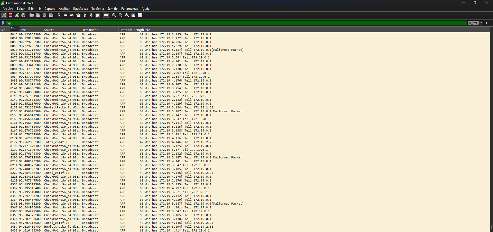
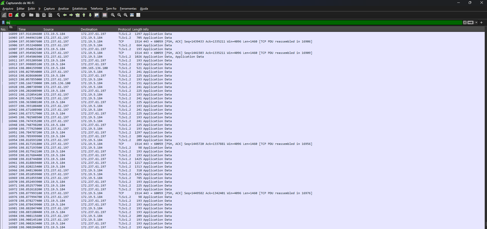
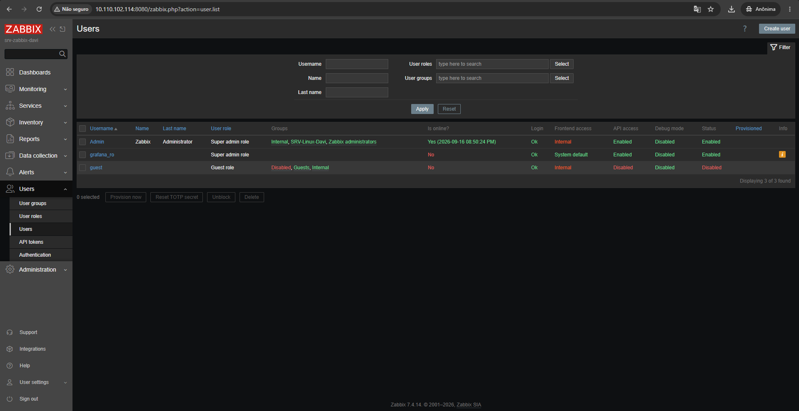

# Projeto Operação NOC — Davi Vilefort Godoi

> \*\*Investigação, Monitoramento e Observabilidade de Redes\*\*
> Ubuntu Server + Redes + Wireshark + Zabbix + Grafana

## Identificação

|Campo|Valor|
|-|-|
|Aluno(a) / Grupo|Davi Vilefort Godoi|
|Turma|Defesa Cibernética — 2026|
|Professor|Frank Philson|
|Data|14/09/2026|
|Rede do laboratório|`10.110.102.0/24`|

## Objetivo

Implementar e documentar um laboratório de **Network Operations Center (NOC)** capaz de monitorar disponibilidade, serviços e recursos, combinando diagnóstico de rede, análise de pacotes, monitoramento com Zabbix e visualização no Grafana.

> \*\*Regra operacional utilizada:\*\* primeiro observar e coletar evidências; depois formular a hipótese, corrigir, validar e documentar.

## Ambiente de referência

|Hostname|IP|Função|
|-|-:|-|
|`SRV-Zabbix-Davi`|`10.110.102.114`|Zabbix Server + PostgreSQL + Nginx|
|`SRV-Grafana-Davi`|`10.110.102.104`|Grafana|
|`SRV-Linux-Davi`|`10.110.102.103`|Servidor monitorado — Ubuntu 22.04.5 + SSH + Apache 2.4.52 + Zabbix Agent|
|Gateway|`10.110.10.1`|Saída da rede do laboratório|

> As imagens abaixo são \*\*ilustrações didáticas\*\* até serem substituídas. Substitua pelas evidências reais do laboratório à medida que forem coletadas.

## Sumário

* [Fase 01 — Planejamento e endereçamento](#fase-01--planejamento-e-enderecamento)
* [Fase 02 — VMs e sistemas operacionais](#fase-02--vms-e-sistemas-operacionais)
* [Fase 03 — IP estático e conectividade](#fase-03--ip-estatico-e-conectividade)
* [Fase 04 — Preparação Linux](#fase-04--preparacao-linux)
* [Fase 05 — Serviços SSH e HTTP](#fase-05--servicos-ssh-e-http)
* [Fase 06 — Diagnóstico manual e Wireshark](#fase-06--diagnostico-manual-e-wireshark)
* [Fase 07 — Zabbix Server](#fase-07--zabbix-server)
* [Fase 08 — Hosts e Zabbix Agent](#fase-08--hosts-e-zabbix-agent)
* [Fase 09 — Monitoramento no Zabbix](#fase-09--monitoramento-no-zabbix)
* [Fase 10 — Grafana](#fase-10--grafana)
* [Fase 11 — API Zabbix](#fase-11--api-zabbix)
* [Fase 12 — Integração Grafana + Zabbix](#fase-12--integracao-grafana--zabbix)
* [Fase 13 — Dashboard NOC](#fase-13--dashboard-noc)
* [Fase 14 — Segurança](#fase-14--seguranca)
* [Fase 15 — Simulação de incidentes](#fase-15--simulacao-de-incidentes)
* [Fase 16 — Evidências e documentação final](#fase-16--evidências-e-documentacao-final)
* [Conclusão](#conclusão)
* [Checklist final](#checklist-final)

\---

## Fase 01 — Planejamento e endereçamento

### Objetivo

Definir rede privada, CIDR, gateway, DNS, IPs e hostnames.

### Execução do exemplo

Foi escolhida a rede privada `10.110.102.0/24` para o laboratório, com os três servidores (`SRV-Zabbix-Davi`, `SRV-Grafana-Davi`, `SRV-Linux-Davi`) endereçados estaticamente dentro dessa faixa.

### Checkpoint

**Tabela de endereçamento preenchida e diagrama da rede.**

### Evidências registradas

* Topologia/CIDR
* Tabela de IPs e hostnames
* Justificativa da faixa escolhida



\---

## Fase 02 — VMs e sistemas operacionais

### Objetivo

Criar as três VMs e instalar o sistema operacional.

### Execução do exemplo

Foram criadas três VMs: `SRV-Zabbix-Davi`, `SRV-Grafana-Davi` e `SRV-Linux-Davi` (Ubuntu Server 22.04.5). *(Confirme CPU/RAM/disco de cada uma com `nproc`, `free -h` e `lsblk` antes de fechar esta seção.)*

### Checkpoint

**SRV-Zabbix-Davi, SRV-Grafana-Davi e SRV-Linux-Davi inicializados.**

### Evidências registradas

* Tela das VMs
* CPU/RAM/disco
* Sistema operacional instalado



\---

## Fase 03 — IP estático e conectividade

### Objetivo

Configurar IPs estáticos, rota, gateway e DNS.

### Execução do exemplo

Os três servidores receberam IP estático (`10.110.102.114`, `10.110.102.104`, `10.110.102.103`) e foram validados com `ip -br addr`, `ip route`, ping e resolução DNS entre eles.

**Comandos/itens de validação:** `ip -br addr` • `ip route` • `ping` • `getent hosts`

### Checkpoint

**As três VMs devem se comunicar e resolver nomes.**

### Evidências registradas

* ip -br addr
* ip route
* ping entre VMs
* resolução DNS



\---

## Fase 04 — Preparação Linux

### Objetivo

Padronizar hostname, atualizar pacotes e validar horário/NTP.

### Execução do exemplo

Os hostnames foram padronizados (`SRV-Zabbix-Davi`, `SRV-Grafana-Davi`, `SRV-Linux-Davi`), os pacotes foram atualizados e o fuso horário foi definido para `America/Sao\_Paulo`.

**Comandos/itens de validação:** `hostnamectl` • `timedatectl` • `apt update`

### Checkpoint

**Hostnames corretos e relógios sincronizados.**

### Evidências registradas

* hostnamectl
* timedatectl
* apt update/upgrade



\---

## Fase 05 — Serviços SSH e HTTP

### Objetivo

Disponibilizar SSH e Apache no SRV-Linux-Davi.

### Execução do exemplo

No `SRV-Linux-Davi`, SSH e Apache 2.4.52 foram instalados, habilitados e testados local e remotamente.

**Comandos/itens de validação:** `systemctl status ssh` • `systemctl status apache2` • `curl`

### Checkpoint

**Portas 22 e 80 acessíveis pela rede do laboratório.**

### Evidências registradas

* systemctl status ssh
* systemctl status apache2
* ss -lntp
* curl



\---

## Fase 06 — Diagnóstico manual e Wireshark

### Objetivo

Registrar o baseline e analisar protocolos antes do monitoramento automático.

### Execução do exemplo

Foi registrado o baseline da rede `10.110.102.0/24` e capturados ICMP, ARP, DNS, TCP e TLS. O three-way handshake foi identificado.

**Comandos/itens de validação:** `icmp` • `arp` • `dns` • `tcp` • `tls`

### Checkpoint

**Capturas de ICMP, ARP, DNS, TCP e TLS.**

### Evidências registradas

* Filtros utilizados
* Three-way handshake TCP
* ICMP/ARP/DNS
* TLS/HTTPS





\---

## Fase 07 — Zabbix Server

### Objetivo

Instalar PostgreSQL, Zabbix Server, frontend (Nginx) e Zabbix Agent no `SRV-Zabbix-Davi`.

### Execução do exemplo

No `SRV-Zabbix-Davi`, PostgreSQL, Zabbix Server, frontend Nginx/PHP-FPM e Zabbix Agent foram instalados e validados.

**Comandos/itens de validação:** `systemctl status zabbix-server` • `systemctl status postgresql` • `systemctl status nginx` • `ss -lntp`

### Checkpoint

**Frontend funcionando e serviços ativos.**

### Evidências registradas

* Serviços ativos (zabbix-server, postgresql, nginx)
* Portas 80/10050/10051
* Tela do frontend


\---

## Fase 08 — Hosts e Zabbix Agent

### Objetivo

Instalar/configurar o Zabbix Agent e cadastrar o `SRV-Linux-Davi` no Zabbix.

### Execução do exemplo

O `SRV-Linux-Davi` foi cadastrado como host e o Zabbix Agent passou a enviar métricas para o `SRV-Zabbix-Davi`.

**Comandos/itens de validação:** `systemctl status zabbix-agent` (ou `zabbix-agent2`, conforme pacote instalado) • `Latest data`

### Checkpoint

**Host disponível e enviando métricas.**

### Evidências registradas

* Host cadastrado
* Agent ativo
* Latest data


\---

## Fase 09 — Monitoramento no Zabbix

### Objetivo

Monitorar disponibilidade, serviços e recursos.

### Execução do exemplo

Foram validados ICMP, HTTP, CPU, memória, disco, rede, uptime e a visão de Problems para o `SRV-Linux-Davi`.

**Comandos/itens de validação:** ICMP • HTTP • CPU • memória • disco • RX/TX • Problems

### Checkpoint

**ICMP, HTTP, CPU, memória, disco, rede e Problems validados.**

### Evidências registradas

* ICMP
* HTTP
* CPU/memória/disco
* Problems


\---

## Fase 10 — Grafana

### Objetivo

Instalar e proteger o Grafana no `SRV-Grafana-Davi`.

### Execução do exemplo

O Grafana foi instalado no `SRV-Grafana-Davi` (`10.110.102.104`) e o acesso ficou restrito à rede do laboratório.

**Comandos/itens de validação:** `systemctl status grafana-server` • porta `3000/TCP`

### Checkpoint

**Grafana ativo e acessível somente pela rede do laboratório.**

### Evidências registradas

* grafana-server
* porta 3000
* login funcional


\---

## Fase 11 — API Zabbix

### Objetivo

Criar identidade de integração de somente leitura.

### Execução do exemplo

Foi criada a identidade `grafana\_ro` no `SRV-Zabbix-Davi`, com permissão somente de leitura e token dedicado. O token real não foi publicado.

### Checkpoint

**Usuário e API Token dedicados criados.**

### Evidências registradas

* Usuário grafana\_ro
* Permissão Read
* Token mascarado



\---

## Fase 12 — Integração Grafana + Zabbix

### Objetivo

Instalar plugin Zabbix e criar o data source.

### Execução do exemplo

O plugin Zabbix foi habilitado no `SRV-Grafana-Davi` e o data source `Zabbix-NOC`, apontando para `http://10.110.102.114`, retornou `Save \& test` com sucesso.

### Checkpoint

**Save \& test concluído com sucesso.**

### Evidências registradas

* Plugin habilitado
* URL da API
* Save \& test OK

\---

## Fase 13 — Dashboard NOC

### Objetivo

Criar dashboard operacional.

### Execução do exemplo

O dashboard reúne disponibilidade dos hosts, CPU, memória, disco, rede, HTTP, uptime e problemas ativos do `SRV-Linux-Davi`.

### Checkpoint

**Painéis de disponibilidade, CPU, memória, disco, rede, HTTP e problemas.**

### Evidências registradas

* Dashboard completo
* Métricas com unidades
* Período de tempo coerente


\---

## Fase 14 — Segurança

### Objetivo

Revisar firewall, SSH, privilégios e exposição de serviços.

### Execução do exemplo

As regras de firewall e os privilégios foram revisados nas três VMs, evitando exposição desnecessária de serviços e credenciais.

**Comandos/itens de validação:** `sudo ufw status numbered`

### Checkpoint

**Somente acessos necessários devem permanecer liberados.**

### Evidências registradas

* ufw status numbered
* Regras de acesso
* Sem segredos no repositório

\---

## Fase 15 — Simulação de incidentes

### Objetivo

Provocar falhas controladas e investigar antes de corrigir.

### Execução do exemplo

Foi simulado o Apache parado no `SRV-Linux-Davi`. O host permaneceu acessível por ICMP, mas o HTTP falhou; a causa foi confirmada via `systemctl`/`journalctl` e o serviço restaurado.

**Comandos/itens de validação:** `systemctl` • `journalctl` • `curl` • `ping`

### Checkpoint

**Incidente detectado, diagnosticado, corrigido e validado.**

### Evidências registradas

* Sintoma
* Evidência
* Hipótese/causa
* Correção
* Validação


\---

## Fase 16 — Evidências e documentação final

### Objetivo

Consolidar o processo técnico realizado.

### Execução do exemplo

As evidências foram organizadas neste README, preservando o histórico técnico e removendo qualquer segredo.

### Checkpoint

**README completo, organizado e sem credenciais expostas.**

### Evidências registradas

* Evidências por fase
* Conclusão
* Dificuldades
* Melhorias futuras

## Conclusão

Ainda não posso escrever a versão final — ela depende do que você realmente viveu no laboratório. Mas com base no que já apareceu (rede 10.110.102.0/24, PostgreSQL+Nginx no Zabbix, o obstáculo do Agent 2), um rascunho seria:

O laboratório permitiu construir, na prática, uma operação NOC completa: da definição de endereçamento até a correlação entre disponibilidade (ICMP), serviço (HTTP/SSH) e coleta de métricas (Zabbix Agent). Um dos aprendizados centrais foi perceber que essas três camadas falham de forma independente — um host pode responder ping e, mesmo assim, não estar sendo monitorado corretamente por causa de incompatibilidade de pacotes.

## Dificuldades

Essa é a parte onde você já tem material real: os dois prints do erro zabbix-agent2 : Depends: libc6 (>= 2.38)... not installable. Isso aconteceu porque o repositório oficial do Zabbix 7.4 exige uma libc/libssl mais nova do que a disponível no Ubuntu 22.04 "jammy".

Preciso que você me diga como resolveu para eu escrever esse trecho corretamente — por exemplo:

Trocou para o repositório do Zabbix 6.4/6.0 (compatível com jammy)?
Instalou o zabbix-agent clássico em vez do agent2?
Outra solução?
Melhorias futuras

Baseado no que você já implementou, dá pra sugerir, por exemplo:

HTTPS no Nginx do Zabbix (hoje é HTTP puro, porta 8080)
Fechar a porta 8080 externamente e manter só acesso interno
Ajustar o gateway na documentação (10.110.10.1 vs rede 10.110.102.0/24)
Automatizar a instalação do Agent com Ansible, evitando o problema de dependência manualmente
Retenção de dados / backup das configurações do Zabbix e Grafana

| Fase | Status | Evidência |
|---|---|---|
| 01 — Planejamento | ✅ | Diagrama de topologia gerado |
| 02 — VMs | ❌ falta | `nproc`, `free -h`, `lsblk` de cada servidor |
| 03 — Conectividade | ✅ | `ip -br addr` / `ip route` / `ping` cruzado |
| 04 — Preparação Linux | ✅ | `hostnamectl` / `timedatectl` / `apt update` |
| 05 — SSH e HTTP | ❌ falta | Precisa ser no **SRV-Linux-Davi** (Apache), não no Zabbix Server |
| 06 — Wireshark | ⚠️ parcial | Tem ICMP, ARP, TLS — faltam **DNS** e **TCP** (three-way handshake) |
| 07 — Zabbix Server | ✅ | `systemctl status ssh/nginx` + `ss -lntp` |
| 08 — Agent | ⚠️ parcial | Tem os erros de instalação — falta o **agent funcionando** + host cadastrado (Latest data) |
| 09 — Monitoramento | ❌ falta | Latest data (CPU/mem/disco/rede) + Problems |
| 10 — Grafana | ❌ falta | Tela de login/porta 3000 |
| 11 — API Zabbix | ✅ | Usuário `grafana_ro` criado |
| 12 — Integração | ❌ falta | Data source Zabbix-NOC + Save & test |
| 13 — Dashboard | ✅ | Dashboard com CPU/memória/rede |
| 14 — Segurança | ❌ falta | `ufw status numbered` |
| 15 — Incidente | ❌ falta | Simulação Apache parado/restaurado |

\---

## Conclusão

O laboratório permitiu acompanhar todo o caminho de uma operação NOC: planejamento, conectividade, diagnóstico de protocolos, implantação do monitoramento, construção de dashboards, aplicação de controles de segurança e investigação de incidentes. O principal aprendizado foi separar **conectividade, serviço e aplicação**: um host pode responder ICMP e, ainda assim, apresentar falha de SSH, HTTP ou coleta do agente.

Como melhoria futura, o ambiente pode receber HTTPS, autenticação centralizada, retenção de métricas ajustada, backups das configurações e integração com um projeto SOC/SIEM separado.

## Checklist final

* \[x] Rede privada e tabela de IPs documentadas.
* \[x] Três VMs instaladas e validadas.
* \[x] IP, gateway, DNS e horário corretos.
* \[x] SSH e HTTP funcionando.
* \[x] Capturas de ICMP, ARP, DNS, TCP e TLS.
* \[x] Zabbix Server e Agent funcionando.
* \[x] ICMP, HTTP, CPU, memória, disco e rede monitorados.
* \[x] Grafana integrado ao Zabbix.
* \[x] Dashboard NOC criado.
* \[x] Regras de segurança revisadas.
* \[x] Incidente controlado investigado e corrigido.
* \[x] Nenhuma credencial real publicada.

## Estrutura deste repositório

```text
projeto-noc-davi/
├── README.md
└── imagens/
    ├── fase01-planejamento.png
    ├── fase02-vms.png
    ├── fase03-conectividade.png
    ├── fase04-preparacao-linux.png
    ├── fase05-servicos.png
    ├── fase06-wireshark.png
    ├── fase11-api-zabbix.png
```

